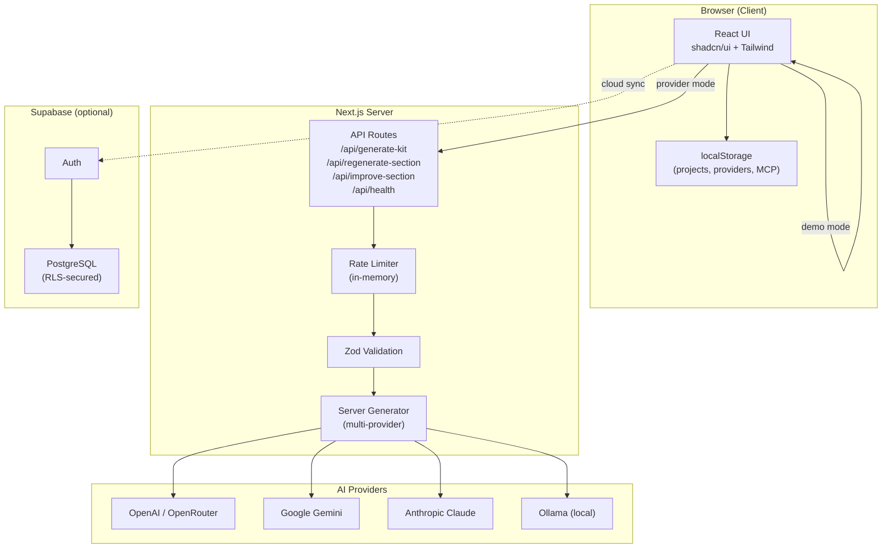
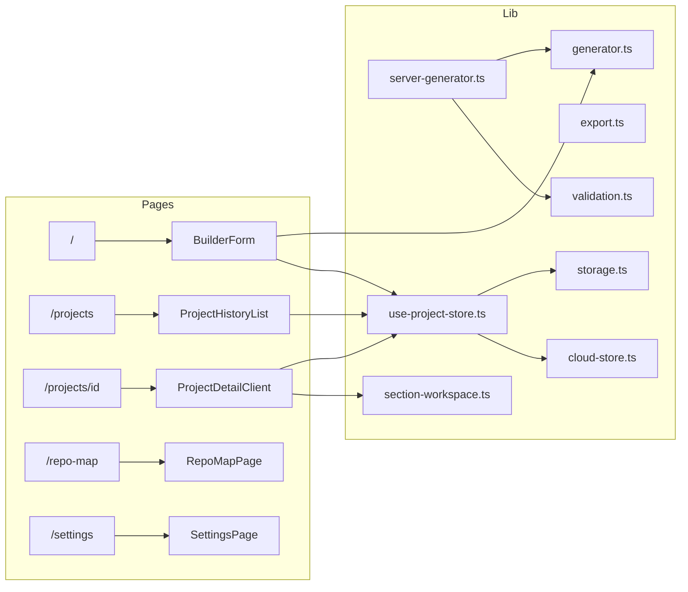

# Architecture

## System Overview

## Data Flow

### Demo Mode (Default)
1. User fills builder form
2. `generator.ts` generates a deterministic kit using templates + repo data
3. Kit is saved to localStorage
4. User browses sections, exports files

### Provider Mode
1. User fills builder form
2. Client calls `/api/generate-kit` with input + provider config (from localStorage)
3. Server validates with Zod, checks rate limit
4. `server-generator.ts` calls the AI provider
5. Response is parsed, validated, and returned
6. Kit is saved to localStorage (or Supabase if authenticated)

### Cloud Sync (Optional)
1. User authenticates via Supabase Auth
2. `useProjectStore` switches from localStorage to cloud store
3. Projects CRUD goes through `cloud-store.ts` → Supabase
4. RLS policies enforce owner-only access
5. API keys remain in localStorage (never synced to cloud)

## Key Design Decisions

| Decision | Rationale |
|---|---|
| **Local-first** | App must work without accounts, API keys, or internet |
| **API keys in localStorage only** | Security: never stored in database or env files |
| **Server-side AI calls** | Prevents API key exposure in browser network tab |
| **Demo mode fallback** | Every feature works without provider configuration |
| **Per-section editing** | Workspace model allows granular review and approval |
| **In-memory rate limiting** | Simple, no Redis needed for single-instance deployment |
| **Zod validation everywhere** | Type-safe input/output at API boundaries |

## Module Dependencies

